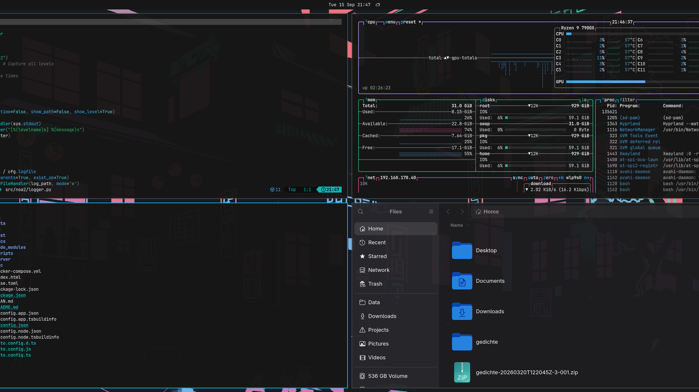

# Carbonfox

A dark [Omarchy](https://omarchy.org) theme ported from [EdenEast/nightfox.nvim](https://github.com/EdenEast/nightfox.nvim)'s **carbonfox** flavor, itself based on IBM's Carbon Design System palette. Near-black background, off-white foreground, and a bright sky-blue accent standing in for Carbon's usual muted blue.



## Install

```bash
omarchy theme install https://github.com/tilman-schieber/omarchy-carbonfox-theme
```

## Palette

| Role | Color |
|---|---|
| accent | `#00b2ff` |
| background | `#161616` |
| lighter background | `#252525` |
| selection | `#2a2a2a` |
| foreground | `#f2f4f8` |
| bright foreground | `#ffffff` |

nightfox defines several of its colors as functions (`brighten()`, `blend()`) rather than literal values, so the background/foreground tiers and the `bright_*` ANSI variants here are computed from those formulas rather than copied. `red`, `yellow`, `orange`, `green`, `cyan`, `blue`, and `magenta` are the literal hexes from the source palette. The accent is a deliberate override — carbonfox has no single defined "accent" color, since it's a syntax-highlighting palette, not a desktop theme. See [`colors.toml`](colors.toml) for the full set.

When you install from this repo, Omarchy skips `hyprland.lua`, `neovim.lua`, and terminal configs — those get regenerated from `colors.toml` through Omarchy's own templates instead. Neovim in particular ends up on Omarchy's generic `aether.nvim` colorscheme fed this palette, not the real carbonfox highlight-group mapping, so exact syntax coloring will differ a bit from running nightfox directly.

Icons use `Yaru-blue`, closest available match to the accent.

## Backgrounds

Three neon-lit isometric/vector city scenes, recolored and adjusted to fit the theme:

- `1-city-map.png` — recolored from its original palette to Carbonfox's, role-for-role (red → red, teal → blue, yellow → yellow, purple → magenta)
- `2-neon-buildings.png` — unedited
- `3-street-signs.png` — darkened
